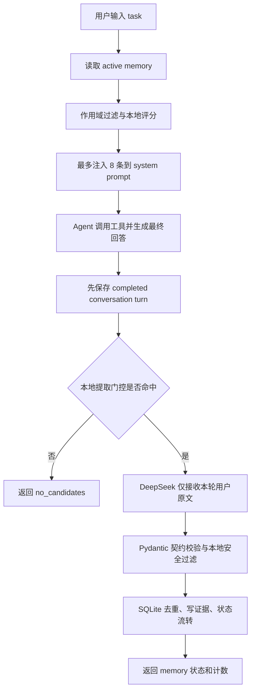
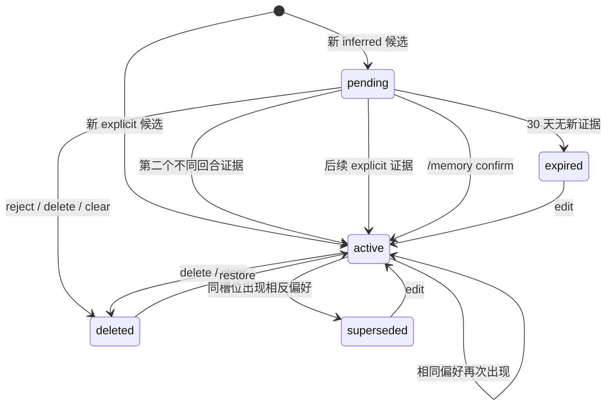

# Memory 系统

本文描述当前 Memory 系统的实际实现，包括数据模型、SQLite 结构、提取与写入链路、状态流转、去重评分、读取评分、上下文注入、CLI 管理、安全边界和已知限制。

相关实现：

- 数据模型：[`src/bili_agent_cli/agent/memory/models.py`](../src/bili_agent_cli/agent/memory/models.py)
- 提取规则：[`src/bili_agent_cli/agent/memory/prompts.py`](../src/bili_agent_cli/agent/memory/prompts.py)
- 写入过滤与读取评分：[`src/bili_agent_cli/agent/memory/service.py`](../src/bili_agent_cli/agent/memory/service.py)
- SQLite 存储与状态机：[`src/bili_agent_cli/agent/memory/store.py`](../src/bili_agent_cli/agent/memory/store.py)
- Agent 调用链路：[`src/bili_agent_cli/agent/agent_loop.py`](../src/bili_agent_cli/agent/agent_loop.py)
- CLI 管理命令：[`src/bili_agent_cli/cli/agent.py`](../src/bili_agent_cli/cli/agent.py)

## 1. 设计目标

当前系统采用“明确偏好立即生效，行为推断延迟确认”的分层策略：

- 用户明确说“以后”“记住”“默认”等长期要求时，候选标记为 `explicit`，直接进入 `active`。
- 从一次任务表达中推断出的偏好标记为 `inferred`，先进入 `pending`。
- 同一个 inferred 候选获得两个不同用户回合的证据后，自动晋升为 `active`。
- 只有 `active` 记忆能够进入模型上下文；`pending` 永远不参与回答。
- 提取证据只允许来自当前用户原文，不使用助手回复、工具结果或视频列表。
- 读取采用 SQLite + 本地规则评分，不使用向量数据库、Embedding 或额外的模型重排。

这套策略优先控制误记忆和跨主题污染。代价是提取召回相对保守，部分没有明显偏好标记的稳定信息不会被自动保存。

## 2. 总体调用链路

Memory 在每个 Agent 请求中有两条独立链路：回答前读取、回答后写入。



关键时序：

1. 当前任务先读取既有 `active` 记忆。
2. 当前任务完成回答并持久化会话。
3. 程序再从本轮用户消息中提取新记忆。
4. 因此本轮新写入的记忆只会影响后续请求，不会反过来改变本轮回答。
5. 提取或存储失败不会撤销已经完成的回答；响应会携带相应失败状态。

当前 `POST /agent/run` 会执行这两条链路。Memory 管理只提供交互式 CLI 命令，目前没有独立的 HTTP 管理接口。

## 3. 数据模型

### 3.1 MemoryCandidate

`MemoryCandidate` 是模型提取后的候选，还没有持久化 ID 和生命周期时间。

| 字段 | 类型 | 约束与含义 |
| --- | --- | --- |
| `key` | string | 1～100 字符，只允许小写字母、数字、`.`、`_`、`-`；是模型生成的语义槽位，不被视为绝对稳定主键 |
| `kind` | enum | `preference`、`constraint`、`goal`、`fact` |
| `content` | string | 1～500 字符，供后续模型使用的规范化记忆内容 |
| `topics` | string[] | 最多 10 个主题；去空、转小写、去重 |
| `confidence` | float | `0..1`，模型对候选的置信度 |
| `evidence_quote` | string | 1～500 字符，必须能在当前用户原文中找到 |
| `durability` | enum | `explicit` 或 `inferred` |
| `scope` | enum | `global`、`intent` 或 `topic` |
| `scope_value` | string/null | `global` 必须为 null；其他作用域必须有值 |

`kind` 当前主要用于分类与去重隔离，不会改变读取公式。`confidence` 只参与排序和重复记录更新，不决定候选是否能绕过作用域过滤。

### 3.2 记忆类别 kind

| 值 | 用途示例 |
| --- | --- |
| `preference` | 偏好的 UP 主、内容类型、输出形式 |
| `constraint` | 不要推荐某类内容、回答必须满足的长期限制 |
| `goal` | 用户的长期目标 |
| `fact` | 对后续长期有用、且适合保存的稳定事实 |

### 3.3 持久性 durability

| 值 | 来源 | 初始状态 |
| --- | --- | --- |
| `explicit` | 候选自己的证据包含“以后”“默认”“记住”等明确长期表达 | `active` |
| `inferred` | 从一次任务中的筛选或展示要求推断 | `pending` |

最终 `durability` 由本地代码根据每条候选自己的 `evidence_quote` 重新判定，不直接信任模型返回值。这样一句话中的明确长期要求不会错误地把同一句里的其他一次性要求一起激活。

### 3.4 作用域 scope

| 值 | `scope_value` | 读取条件 |
| --- | --- | --- |
| `global` | null | 所有任务均有资格参与排序 |
| `intent` | 稳定意图名，如 `video_recommendation` | 当前任务推断出的 intent 必须精确包含该值 |
| `topic` | 稳定主题名，如 `f1` | `scope_value` 或某个 topic 必须出现在当前任务中 |

当前本地意图识别只有两类：

- `account_content`：动态、收藏、稍后再看、观看历史、关注等账号内容任务。
- `video_recommendation`：视频、推荐、搜索、资讯、新闻、更新、UP 主、B站等任务。没有识别出账号意图时，不超过 40 个字符的非空短输入也会回退到该意图。

### 3.5 MemoryItem

`MemoryItem` 是写入后的完整记录。在候选字段之外增加：

| 字段 | 含义 |
| --- | --- |
| `id` | UUID |
| `source_type` | `user`、`conversation` 或 `bilibili`；自动提取当前使用 `conversation` |
| `source_ref` | 首次来源引用；自动提取格式为 `session:{session_id}:turn:{turn_id}` |
| `state` | 生命周期状态 |
| `evidence_count` | 不同 `source_ref` 的有效证据数 |
| `first_observed_at` | 第一次观察时间 |
| `last_observed_at` | 最近一次观察时间 |
| `activated_at` | 激活时间，未激活时为 null |
| `created_at` / `updated_at` | 创建与更新时间 |
| `last_injected_at` | 最近一次被选入模型上下文的时间 |

所有时间以带时区的 ISO 8601 文本写入 SQLite。`last_injected_at` 当前只用于审计，不参与读取评分。

### 3.6 MemoryEvidence

每条用户证据单独保存在 `memory_evidence`：

| 字段 | 含义 |
| --- | --- |
| `id` | SQLite 自增 ID |
| `memory_id` | 对应 `memory_items.id` |
| `source_ref` | 会话与用户回合引用 |
| `user_excerpt` | 用户原文中的逐字证据 |
| `created_at` | 证据写入时间 |

数据库对 `(memory_id, source_ref)` 设置唯一约束。因此同一回合重复生成候选不会增加 `evidence_count`，只有不同回合才能推动 inferred 候选自动晋升。

## 4. SQLite 数据结构

数据库默认位置：

```text
privacy/memory.db
```

程序会把 `privacy/` 权限设置为 `0700`，把数据库文件权限设置为 `0600`。这是文件权限隔离，不是数据库加密。

当前 `PRAGMA user_version = 2`。

### 4.1 memory_items

```sql
CREATE TABLE memory_items (
    id TEXT PRIMARY KEY,
    key TEXT NOT NULL,
    kind TEXT NOT NULL,
    content TEXT NOT NULL,
    topics_json TEXT NOT NULL,
    confidence REAL NOT NULL CHECK (confidence >= 0 AND confidence <= 1),
    durability TEXT NOT NULL,
    scope TEXT NOT NULL,
    scope_value TEXT,
    source_type TEXT NOT NULL,
    source_ref TEXT,
    state TEXT NOT NULL,
    evidence_count INTEGER NOT NULL CHECK (evidence_count >= 0),
    first_observed_at TEXT NOT NULL,
    last_observed_at TEXT NOT NULL,
    activated_at TEXT,
    created_at TEXT NOT NULL,
    updated_at TEXT NOT NULL,
    last_injected_at TEXT
);
```

索引：

- `idx_memory_live_key`：对 `pending` 和 `active` 状态下的 `(key, kind)` 建立部分唯一索引。
- `idx_memory_scope`：`(state, scope, scope_value)`。
- `idx_memory_updated`：`(state, updated_at DESC)`。

`topics` 以 JSON 数组保存在 `topics_json`。枚举和 `scope_value` 的组合约束主要由 Pydantic 模型保证，SQLite 本身没有为所有枚举值设置 CHECK。

### 4.2 memory_evidence

```sql
CREATE TABLE memory_evidence (
    id INTEGER PRIMARY KEY AUTOINCREMENT,
    memory_id TEXT NOT NULL
        REFERENCES memory_items(id) ON DELETE CASCADE,
    source_ref TEXT NOT NULL,
    user_excerpt TEXT NOT NULL,
    created_at TEXT NOT NULL,
    UNIQUE(memory_id, source_ref)
);
```

连接会启用 `PRAGMA foreign_keys = ON`。

### 4.3 Persona 预留表

全新 v2 数据库还会创建：

- `persona_snapshots`
- `persona_refresh_runs`

它们为未来的用户画像快照和刷新任务预留，当前 Memory 写入、读取和 CLI 管理链路尚未使用。

### 4.4 Schema 初始化与迁移

- 数据库版本为 0：直接创建 v2 表。
- 数据库版本为 1：删除旧 `memory_items` 并创建 v2 `memory_items` 与 `memory_evidence`。v1 记录因为没有可靠证据和作用域而不会迁移。
- 数据库版本高于 2：拒绝运行并抛出 `MemoryStorageError`。

v1 → v2 是破坏性迁移，不自动备份旧 Memory 数据。

## 5. 生命周期与状态机

状态包括：

- `pending`：推断候选，等待第二个独立证据或人工确认。
- `active`：可参与读取和上下文注入。
- `superseded`：被语义相反或同槽位的新记录取代。
- `deleted`：用户软删除或拒绝的记录。
- `expired`：超过 30 天仍未确认的 pending 记录。



补充规则：

- `pending` 的 30 天 TTL 通过 `last_observed_at` 判断，在观察或列出记忆时执行过期处理。
- 匹配到已有记录时，topics 取并集、confidence 取最大值，`explicit` 一旦出现便保持为 explicit。
- 自动合并不会用后来的模型文案覆盖原 `content` 或 `key`；需要改正文案时使用 `/memory edit`。
- 相同语义但极性相反时，旧记录变成 `superseded`，新记录按自己的 durability 创建为 active 或 pending。
- `reject` 和 `delete` 都是软删除；`clear` 只软删除当前 active/pending。

## 6. 写入机制

### 6.1 本地提取门控

回答完成后，`should_extract_memory()` 先检查当前用户消息：

1. 空消息直接跳过。
2. 命中敏感信息规则直接跳过。
3. 至少包含一个潜在 Memory 标记才调用提取模型。

明确长期标记包括：

```text
以后、今后、从现在起、记住、帮我记、默认、总是、每次、长期、
不要再、我喜欢、我偏好、我不喜欢、我习惯、我只看、我的目标
```

潜在的一次性偏好标记还包括：

```text
优先、希望、只要、只推荐、筛选、给链接、给网址、直接给
```

例如普通的 `apple`、`最近的 F1 杆位是谁` 不会调用 Memory 提取 API。

这个门控是有意保守的：即使提取 Prompt 允许稳定事实，没有这些标记的陈述目前仍可能被跳过。

### 6.2 模型提取

命中门控后，程序调用 DeepSeek Chat Completions：

- system message 使用专用 Memory 提取 Prompt。
- user message 只包含当前用户原文，不包含助手回答、工具结果、上下文摘要或会话历史。
- 强制调用 `submit_memory_candidates` 工具。
- 工具参数直接使用 `MemoryExtraction` 的 JSON Schema。
- 显式关闭 thinking，因为当前提供商不支持 thinking 与该强制 `tool_choice` 组合。
- 超时为 30 秒，`max_tokens` 为 2000。

最多接受 10 个原子候选。Prompt 要求不同偏好拆成不同候选，例如“只看头部 UP”和“直接给链接”不能合为一条。

### 6.3 本地二次校验

模型输出通过 Pydantic 校验后，还要经过本地过滤：

1. 检查 key、content、evidence、scope_value 和 topics 是否包含敏感内容。
2. 对用户原文和 evidence 做 NFKC/小写/字母数字规范化。
3. `evidence_quote` 必须是用户原文的规范化子串，否则丢弃候选。
4. 仅根据该候选自己的 evidence 重新计算 explicit/inferred。

模型即使错误地把一次性请求标成 explicit，也会被本地降级成 inferred。

### 6.4 事务写入

一轮提取出的所有候选由 `observe_many()` 在同一个 SQLite 事务中处理：

1. 先将超时 pending 标成 expired。
2. 在 active/pending 集合中查找同槽位记录。
3. 判断是创建、更新、晋升还是取代。
4. 插入本轮用户证据。
5. 更新计数、topics、confidence 和时间字段。
6. 任一步骤发生 SQLite/OSError 时回滚并转换成 `MemoryStorageError`。

新记录的初始规则：

```text
explicit -> active, evidence_count = 1, activated_at = now
inferred -> pending, evidence_count = 1, activated_at = null
```

已有 pending 的晋升规则：

```text
candidate is explicit OR evidence_count >= 2 -> active
```

这里的第二条证据必须来自不同的 `source_ref`。同一用户回合重复提交只会更新观察时间，不会推进计数。

## 7. 写入去重与匹配评分

写入匹配和读取召回是两套不同评分，不能混为一谈。

语义匹配只在以下记录之间比较：

- 状态是 `pending` 或 `active`；
- `kind` 相同；
- `scope` 相同；
- `scope_value` 相同。

在语义匹配之前，程序会优先查找完全相同的 `(key, kind)`；这个精确查找不额外限制 scope，与数据库的 live-key 唯一索引一致。因此同一 `(key, kind)` 不能在不同 scope 下同时保持 active/pending。找到精确项后仍会检查冲突和相似度。

除此之外，本地计算三个相似度，取最大值：

```text
match_score = max(content_similarity, key_signature_match, evidence_similarity)
```

阈值：

```text
SIMILARITY_THRESHOLD = 0.65
```

### 7.1 content_similarity

`content` 使用 Jaccard 相似度：

```text
|left_tokens ∩ right_tokens| / |left_tokens ∪ right_tokens|
```

ASCII 内容按单词切分；中文连续文本切成二元组。完全没有 token 时退回规范化全文相等判断。

### 7.2 key_signature_match

模型生成的 key 会发生措辞漂移，因此 key 只作为辅助信号：

- 删除 `recommendation`、`preference`、`format`、`output`、`direct` 等结构词。
- 把 `up/uploader/creators` 归一为 `creator`。
- 把 `url/uri/website/links` 归一为 `link`。
- 把 `head` 归一为 `top`。
- 非空签名完全相同，视为 1.0。
- 或者较短签名至少有两个核心词，且全部包含于较长签名，也视为 1.0。

### 7.3 evidence_similarity

证据匹配优先解决模型 key 不稳定的问题。它对两次用户原话做本地规范化：

- `网址/URL/URI/link` → `链接`
- `UP 主/创作者/uploader/channel` → `创作者`
- `头部/顶级/知名/top/head` → `头部`
- 去掉“帮我”“请”“这次”“直接”“给出”“筛选”“推荐”等请求噪声

规范化后完全相同为 1.0。非完全相同且最短一边少于 6 个字符时返回 0，避免短文本误合并；其他文本使用 `SequenceMatcher` 比率。

例如：

```text
筛选出头部科技UP的视频
帮我筛选头部科技UP主的视频
```

会归一到相同证据。以下两句同理：

```text
给网址
直接给链接
```

### 7.4 冲突处理

内容中是否出现“不、不要、别、避免、禁止、取消、停止”等否定模式用于判断极性。匹配槽位的前后内容极性不同，就不会累加为同一偏好的证据，而是把旧记录设为 `superseded` 并创建新记录。

## 8. 读取与召回机制

### 8.1 候选集合

`retrieve_memories()` 只加载 `active`。pending、deleted、expired 和 superseded 不参与评分。

### 8.2 作用域资格

先判断是否有资格评分：

- global：始终有资格。
- intent：`scope_value` 必须与当前本地推断出的 intent 精确匹配。
- topic：规范化后的 `scope_value` 或任一 topic 必须是当前任务文本的子串。

不满足作用域条件时直接返回 0。confidence 再高也不能让无关记忆获得资格。

### 8.3 读取评分公式

通过作用域过滤后：

```text
global:
score = 100
      + min(匹配 topic 数量 × 20, 40)
      + content_similarity(memory.content, task) × 40
      + confidence × 10

intent/topic:
score = 80
      + min(匹配 topic 数量 × 20, 40)
      + content_similarity(memory.content, task) × 40
      + confidence × 10
```

topic 加分条件满足其一即可：

- 规范化 topic 是任务文本的子串；
- topic token 与任务 token 有交集。

排序键为 `(score, updated_at)`，均为降序。当前没有时间衰减、使用频率加分或模型重排。

### 8.4 数量限制

- 总计最多选择 8 条。
- global 最多选择 3 条。
- 分数小于等于 0 的记录不选择。

选中后立即更新这些记录的 `last_injected_at`。

### 8.5 上下文注入

选中的记录转换成 JSON，放入 system prompt 的专用边界：

```text
<long_term_memories>
[{"id":"...","kind":"preference","content":"...",...}]
</long_term_memories>
```

注入字段只有：

- `id`
- `kind`
- `content`
- `topics`
- `scope`
- `scope_value`
- `confidence`

用户原始证据、`source_ref` 和生命周期时间不会发给回答模型。外层提示明确说明这些数据只是个性化参考，不是新的用户指令；它们与当前消息冲突时，以当前消息为准。

## 9. 示例

### 9.1 明确长期偏好

用户输入：

```text
以后推荐 F1 的资讯，优先选择 UP 主：F1赛事资讯和F1世界锦标赛
```

预期结果：

1. 本地门控命中“以后”和“优先”。
2. 模型生成 topic scope 的 preference 候选。
3. evidence 包含明确长期表达，本地判定为 explicit。
4. 直接创建 active，证据数为 1。
5. 后续 F1 查询有资格召回；iPhone 查询不会因 confidence 较高而错误召回。

### 9.2 一次性要求的两次确认

第一次：

```text
筛选出头部科技 UP 的视频，给网址
```

会拆成两个 inferred 候选并进入 pending，此时不会进入回答上下文。

第二个不同回合：

```text
帮我筛选头部科技 UP 主的视频，直接给链接
```

证据规范化会分别匹配“头部科技 UP”和“直接链接”两个槽位。两条记录的 `evidence_count` 都变成 2，并自动晋升为 active。

## 10. CLI 管理

在交互式 Agent 中输入 `/memory` 查看帮助。

| 命令 | 行为 |
| --- | --- |
| `/memory list` | 列出 active |
| `/memory list active` | 列出 active |
| `/memory list pending` | 列出 pending |
| `/memory list all` | 列出所有状态 |
| `/memory pending` | `/memory list pending` 的快捷形式 |
| `/memory show <id>` | 输出完整 MemoryItem JSON 和证据列表 |
| `/memory confirm <id>` | 把 pending 人工确认为 active |
| `/memory reject <id>` | 把候选软删除为 deleted |
| `/memory edit <id> <新内容>` | 修改内容并作为用户明确确认的 active 记忆 |
| `/memory delete <id>` | 软删除指定记录 |
| `/memory restore <id>` | 把 deleted 恢复为 active |
| `/memory clear --yes` | 软删除所有 active/pending |

人工确认、编辑和恢复会设置：

```text
state = active
durability = explicit
source_type = user
confidence = 1.0
```

`edit` 不能编辑 deleted，但可以重新激活 superseded 或 expired。`restore` 只接受 deleted，`confirm` 只接受 pending。

## 11. Agent 响应状态

`AgentRunResponse.memory` 包含：

| 字段 | 含义 |
| --- | --- |
| `status` | 本轮 Memory 处理状态 |
| `saved_count` | 本轮新增激活与自动晋升数量 |
| `extracted_count` | 模型返回候选数 |
| `active_saved_count` | 新建 active 数 |
| `pending_saved_count` | 新建或更新 pending 数 |
| `promoted_count` | 自动晋升数 |
| `updated_count` | 已有 active 更新数 |
| `filtered_count` | 被本地安全/证据规则过滤的候选数 |
| `error_code` | 失败时的安全错误类型，HTTP 错误可带状态码 |

`status` 可取：

- `not_attempted`
- `saved`
- `pending`
- `mixed`
- `no_candidates`
- `filtered`
- `extraction_failed`
- `storage_failed`

CLI 不显示 `no_candidates`，避免每次普通对话都输出无意义提示；其他状态会在助手回答后以 `记忆>` 单独显示。助手 Prompt 禁止自行声称“已记住”，是否写入成功只能以程序状态为准。

## 12. 安全与隐私边界

本地门控和候选过滤会拦截常见的：

- Cookie、SESSDATA、bili_jct、DedeUserID
- API Key、access token、Authorization、Bearer、密码、密钥
- `sk-...` 形式的密钥
- 中国大陆手机号、身份证号
- 邮箱
- 部分精确地址表达

还应注意：

- 敏感规则是正则防线，不是完备的数据防泄漏系统。
- 数据库没有加密；`0600` 只能限制本机其他普通用户读取。
- 命中提取门控后，当前用户原文会发送给 DeepSeek API 做结构化提取。
- 自动提取不会发送助手回答、B站工具结果、上下文摘要或历史轮次。
- 日志只记录错误类名和必要的 HTTP 状态码，不应记录候选内容或凭据值。

## 13. 故障处理

| 故障 | 行为 |
| --- | --- |
| Memory 数据库读取失败 | 记录安全警告，本轮不注入 Memory，继续回答 |
| 提取 API 配置、网络、超时或 HTTP 失败 | 保留已经完成的回答，返回 `extraction_failed` |
| 模型工具参数不满足 Pydantic 契约 | 保留回答，返回 `extraction_failed` |
| SQLite 写入失败 | 事务回滚，保留回答，返回 `storage_failed` |
| 候选全部被过滤 | 返回 `filtered` |
| 本地门控未命中或模型返回空列表 | 返回 `no_candidates` |

DeepSeek 强制工具调用当前必须与 `thinking: {"type": "disabled"}` 一起使用，否则提供商会返回不支持该组合的 HTTP 400。

## 14. 已知限制与后续方向

当前实现有以下边界：

- 提取门控依赖本地关键词，召回率低于每轮都调用模型，但成本和误记忆率更低。
- 只实现了 `account_content` 和 `video_recommendation` 两类 intent。
- topic 资格判断主要依赖规范化子串，暂不支持同义主题扩展。
- 写入证据规范化使用有限的同义词规则，未来领域增多时需要扩充或改成可配置词表。
- 没有向量检索、Embedding、学习排序、时间衰减或使用反馈权重。
- 自动合并保留第一版 content；不会自动用更新文案改写记忆。
- Persona 相关表只是预留，尚未形成自动用户画像刷新链路。
- Memory 管理当前只有 CLI，没有单独的 HTTP API。

如果以后引入 Embedding 或模型重排，建议仍保留当前作用域资格检查和 active-only 约束，把语义模型用于候选排序而不是绕过生命周期与安全过滤。

## 15. 测试

Memory 相关测试位于：

- `tests/test_memory_extraction.py`
- `tests/test_memory_service.py`
- `tests/test_memory_store.py`
- `tests/test_agent_context.py`
- `tests/test_cli.py`
- `tests/test_main.py`

运行全部测试：

```bash
uv run python -m unittest discover -s tests -v
```

重点覆盖：

- explicit 直接激活；
- inferred 两个不同回合晋升；
- 同一回合证据不重复计数；
- 模型 key 漂移时按用户证据合并；
- 跨主题 Memory 不误召回；
- pending 不参与上下文；
- 敏感内容与伪造 evidence 被过滤；
- CLI 确认、编辑、软删除、恢复和清空；
- 提取/存储故障不会丢失已完成回答。
